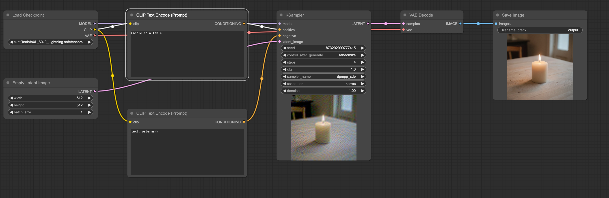

# Simple Frontend For ComfyUI workflow

A simple base front-end for text-to-image workflow in ComfyUI. Meant to server as a base to be modified for future complex workflows

Inspired by https://www.youtube.com/watch?v=anYHG37fUg4 , but some of his endpoints didn't quite work the same for me, so I modified them by following some example usage from ComfyUI Github documentation

Workflow:

Equivalent UI:

## Introduction
Building a front-end UI for ComfyUI workflows using their API.
The front-end will be able to take in text input and display the generated image output.

This is a simple UI meant to be a base for future more complex workflows.

## Installation

Simply git clone this repository in your `comfyui/custom_nodes` directory.
This does not require any external python packages

## Modifications

The workflow is embedded in the file `web/js/app.js` in the `workflow` variable.

The initial plan was to have it load from an external json file but for some reason, the changes made to json were not changing during server restarts, so for sake of consistency, the workflow is embedded in the file.
Feel free to move to a `.json` file and pull it via `fetch` if the workflow is too large.

To modify the workflow, simply find the appropriate settings in the `workflow` variable and modify them.
Some notable settings:

1. `sampler_name`, `scheduler`, `steps`, `cfg` (`KSampler`)
2. `ckpt_name` (`CheckpointLoaderSimple`) : This needs to be the exact filename of the checkpoint in ComfyUi/models/checkpoints
3. `width`, `height` (`EmptyLatentImage`)

## Usage
1. Start the ComfyUI server with `python main.py --listen 0.0.0.0 --enable-cors-header '*'`
2. Find your computer's IP address and navigate to `http://<your-ip>:8188/comfyui-testui` to start using it

## Code Smells:

1. The workflow is embedded in the `app.js` file. This is not ideal and should be moved to a separate file and fetched via `fetch` for better maintainability.
2. It's using Tailwind CDN. Didn't want to go through the hassle of setting up a build system for this simple project. This should be changed to a build system for production.